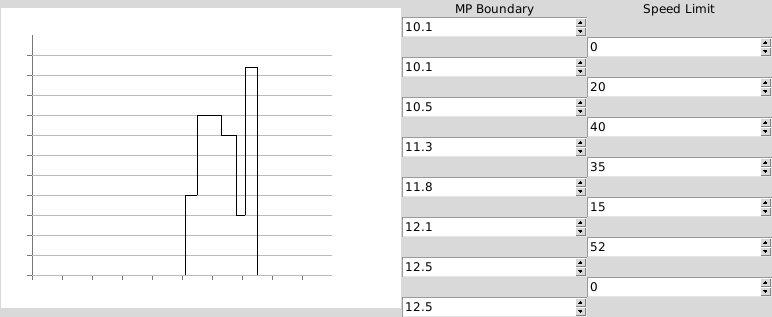
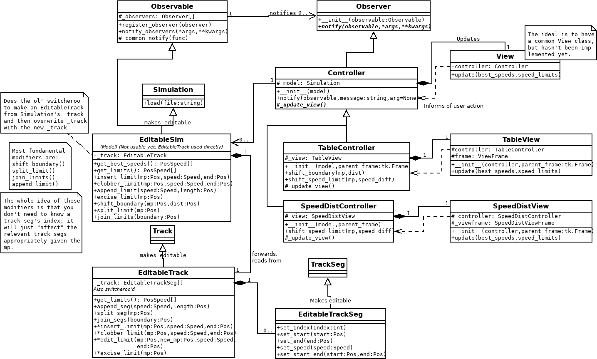
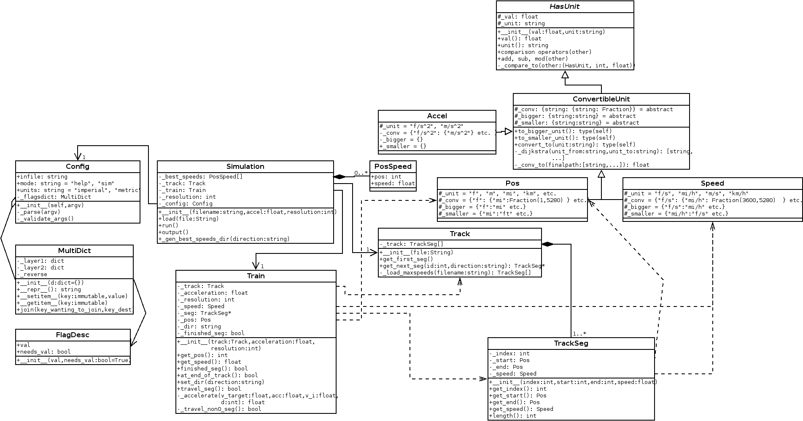

# trainspeedsim and trainspeedsimg
trainspeedsim outputs train speed along track given speed limits at points along the track.

trainspeedsimg uses the internals of trainspeedsim, supplemented with editing capability, in a GUI desktop program using Tkinter. It is in an incomplete, though runnable, state.

trainspeedsimg will be covered first.

## trainspeedsimg

trainspeedsimg provides an editable sequence of track speed limit sections in the form of:

* A graph, displaying the speed limit sections, which are click-and-draggable. It will soon display a live view of the simulation results.
* A table of numeric entry spinboxes. These provide incrementable editing of speed limits and section boundaries.

Overall it is designed following Model-View-Controller. The core simulation is the model, and each pane of the GUI is a view-controller pair. All views are automatically updated by their controllers in the Observer pattern: all controllers observe the same model. This way, edits in one view instantly are applied to all views.

trainspeedsimg's interface:

Like trainspeedsim below, UML class diagramming was used to design the program. It has grown as the program has become increasingly complex, though the core MVC pattern is still apparent. GUI-specific classes are not shown for brevity.

## trainspeedsim

### Usage

`trainspeedsim [-h|--help | OPTIONS] INPUT_FILE`  
`OPTIONS:`  
`  -u|--units: imperial|metric   (default: imperial)`  
`  -a|--acceleration: decimal value (default: 1.5 ft/s^2 or that converted to`  
`    m/s^2)`  
`  -r|--resolution: integral value (default: 528 f or 100 m)`  

INPUT_FILE must be a tab-separated value file of mileposts (in miles or kilometers) paired with speed limits (in mi/h or km/h). These represent the speed limit between that milepost and the next entry's milepost. All mileposts must be monotonically increasing.

The first and last mileposts must have a speed of 0.

Any milepost with a speed limit of 0 must be followed by another entry using the same milepost but a positive speed limit, except for the last one, which must be preceded by an entry using the same milepost but a positive speed limit.

Example contents of input file (call it `limits.csv`):

`99.3	0`  
`99.3	25`  
`99.5	20`  
`99.6	0`  
`99.6	30`  
`99.9	50`  
`102.0	25`  
`102.3	25`  
`102.3	0`  

"Resolution" is smallest unit of distance over which the train's acceleration is calculated. In `limits.csv`, a suitable resolution would be 0.1 mile, or 528 feet. (This value is indeed the default.) All milepost numbers in the input must be multiples of this resolution.

### Example

Command:

`$./trainspeedsim limits.csv`  

This is equivalent to:

`$./trainspeedsim -u imperial -r 528 -a 1.5 limits.csv`

Output:

`99.3, 0.0`  
`99.4, 24.771684715343113`  
`99.5, 20.0`  
`99.6, 0.0`  
`99.7, 24.771684715343113`  
`99.8, 30.0`  
`99.9, 30.0`  
`100.0, 38.90547986641938`  
`100.1, 46.122366887148445`  
`100.2, 50.0`  
`100.3, 50.0`  
`100.4, 50.0`  
`100.5, 50.0`  
`100.6, 50.0`  
`100.7, 50.0`  
`100.8, 50.0`  
`100.9, 50.0`  
`101.0, 50.0`  
`101.1, 50.0`  
`101.2, 50.0`  
`101.3, 50.0`  
`101.4, 50.0`  
`101.5, 50.0`  
`101.6, 50.0`  
`101.7, 49.657920726799375`  
`101.8, 43.038038143864405`  
`101.9, 35.19426606190792`  
`102.0, 25.0`  
`102.1, 25.0`  
`102.2, 24.771684715343113`  
`102.3, 0.0`  

### Design

The program uses an object-oriented design. The primary singleton is the Simulation, which owns the singletons Train, Track, and Config, and generates the PosSpeeds as the output. The core classes of Simulation, Train, Track, TrackSeg, and PosSpeed were the first classes designed and remained virtually unchanged over the course of development.

Interesting points:

* Config stores the command-line arguments as entries in a MultiDict. The MultiDict maps multiple keys to the same value, making operations using synonymous keys identical. In this way the user can enter arguments using short or long flags.
* The classes HasUnit and ConvertibleUnit are effectively abstract classes, as though they define operations, the conversion ratios they operate with are defined in the child classes Accel, Pos, and Speed.
* ConvertibleUnit uses Dijkstra's algorithm to find a chain of valid conversion ratios to perform the requested unit conversion
* Train's operation is well-encapsulated. The only operations its interface defines are setting the direction of its travel, and traveling over one resolution of distance. Which track segment it is on, transferring from one track segment to the next, and whether it has finished a segment are all transparent to the user.
* The provided speed limit files use real data for North County Transit District's Sprinter light rail, from the document "California Passenger Rail Network Schematics April 2016", published by Caltrans. The running time generated by the program (when station dwell times are added) indeed matches the real-life timetable.

UML class diagramming was used before any code was written. As the code changed, the diagram was updated to match it, and vice-versa. The current class diagram:

